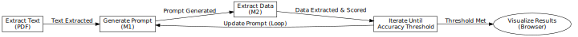
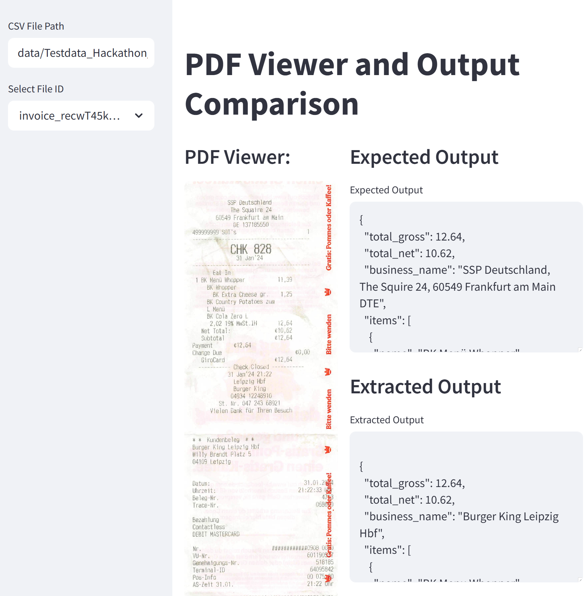

# Promptless



---
This is the work done as team "Promptless" during the cheftreff hackathon, Apr 2025, Hamburg. The task is to create an AI agent that can generate prompts given the output.
## Installation

To set up the project, follow these steps:

1. **Clone the Repository**:
   ```bash
   git clone https://github.com/your-repo-name/promptless_cheftreff_beamAI.git
   cd promptless_cheftreff_beamAI

   python3 -m venv venv
   source venv/bin/activate

   python3 -m venv venv
   source venv/bin/activate   

   pip install -r requirements.txt
   sudo apt-get update
   sudo apt-get install -y poppler-utils
   ```
> Make sure the **api** for gpt is included in the ```.env``` file.

2. **Working with Promptless**:
## converting the pdf to text file using pytesseract
```python parser.py data/Testdata_Hackathon.csv```

## extracting required information using a generated prompt
```python script.py```

## Progress Update
use streamlit to see the general result
>```streamlit run dashboard.py```

---
### What We Have Accomplished:

1. **Meta Prompt Development**:
   - Created a universal meta prompt capable of generating custom extraction prompts for both invoice and order request use cases.
   - Optimized the meta prompt to handle edge cases and ensure high accuracy in data extraction.

2. **Parsing & Extraction Workflow**:
   - Developed an automated workflow to parse PDFs, extract required data fields, and output results in the specified JSON format.
   - Integrated the workflow with Airtable API for seamless data retrieval and submission.

3. **Accuracy Testing**:
   - Benchmarked the extracted data against the provided ground truth datasets.
   - Achieved high precision and consistency in data extraction for both use cases.

4. **Automation**:
   - Automated the entire pipeline, ensuring scalability and adaptability to new document formats without manual intervention.

---

### Next Steps:

- Further optimize the meta prompt for additional edge cases.
- Conduct additional testing to improve accuracy metrics.
- Prepare the final accuracy report for submission.